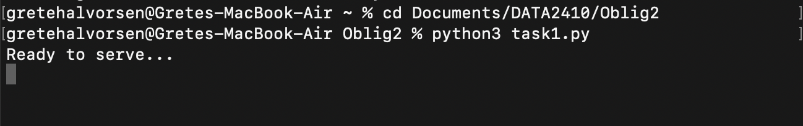
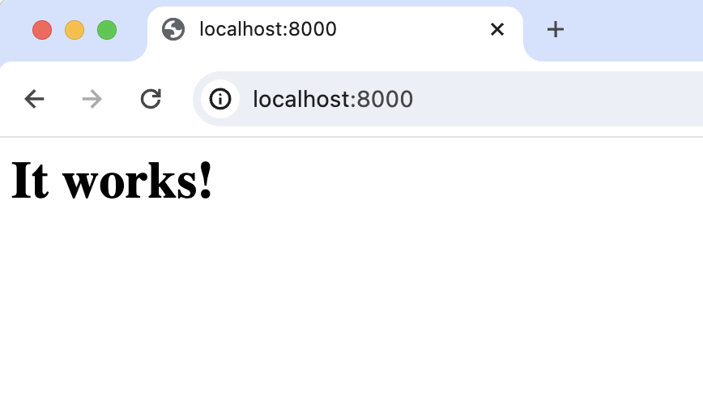
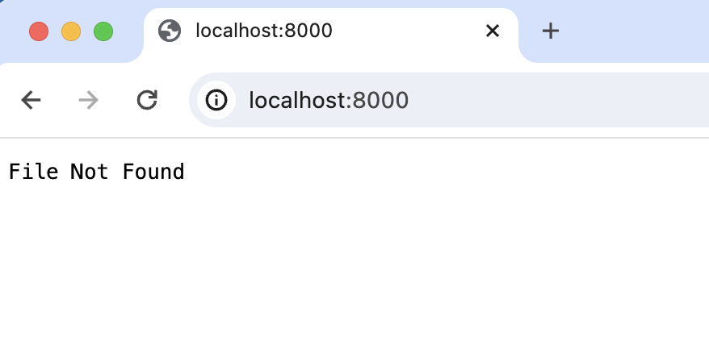
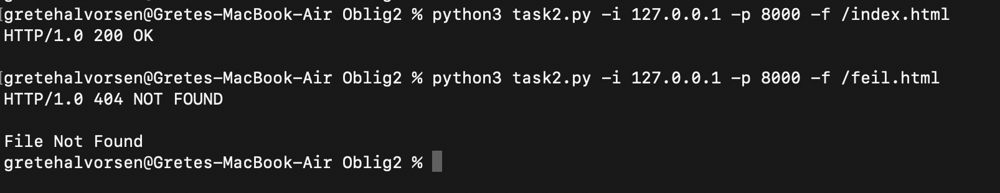
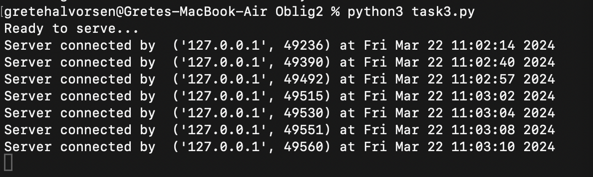

<h2>Second oblig from course DATA2410 Networking and Cloud Computing</h2>

The scripts are based on the skeleton code provided in the assignment and examples provided in our labs. I have adapted the examples to fit the requirements of the assignment. The original code was used as a foundation, and I've built upon it by adding, modifying, and removing parts as necessary.

[Skeleton code](/webserver-task1-skeleton-code.py) 
<a href="https://github.com/safiqul/2410/blob/main/thread/tcpclient-multi.py" target="_blank">
Lab: Socket Programming (TCP)</a> 
<a href="https://github.com/safiqul/2410/blob/main/thread/tcpserver-multi.py" target="_blank">
Lab: Socket Programming (A multi-threaded TCP server)</a>

<h1>Task 1</h1>
This is a web server that handles one HTTP request at a time.
To run the file type <code>python3 task1.py</code> in the terminal 

  
Go to your browser and open localhost:8000 og localhost:8000/index.html to view the index page  

Image showing when localhost find index.html file
If you try to find a file that is not in the directory you will se a 404 Not Found message in the browser.

 Image showing the result then localhost:8000/index.html is removed. Also works if you type wrong file-name localhost:8000/indexx.html

This task was based on the provided skelton code from the 

<h1>Task 2</h1>
Task 2 is a HTTP client that can connect to the server with TCP connection. The client send a HTTP request to the server and display the response in the terminal. The client takes command line arguments specifying server IP address/hostname, the port the server is listening and the path to the requested file with the required command format <code>python3 client.py -i server\_ip -p server\_port -f filename</code>
  
To run the client type into the terminal: 
<code>python3 task2.py -i 127.0.0.1 -p 8000 -f /index.html</code>  

 
Image showing the client run with both responses.

<h1>Task 3</h1>
This is a multithreaded server that is capable of serving multiple request simultaneously. To run the server type <code>python3 task3.py</code> in the terminal.

Image shows the server running with multiple connections at the same time. I used the same client as in task 2 from multiple terminal windows.

